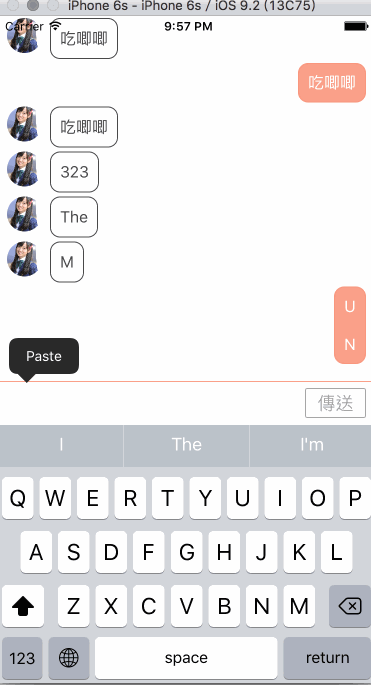
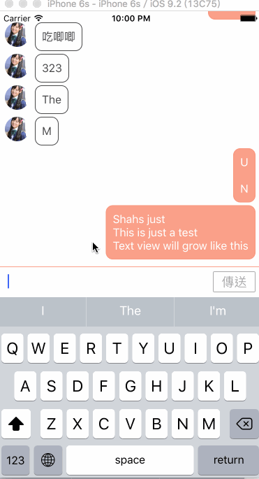

#DLMessageView
###### 一個簡易的訊息套件
## 一開始總要說個故事
這個故事要從一年半前的現在說起，當時的我一直想要寫個聊天室，於是我在網路上找了一堆套件，想說既然他可以寫出來為什麼我就不行。當時傻傻的我就開始嘗試要寫，但是連個viewDidLoad都不知道在幹嘛的小毛頭，一定是寫不出來的啦！何況現在的我用了一個禮拜的時間來寫，都只寫出的皮毛而已呢！

能寫出這個套件，JSQMessageViewController幫了我很大的忙，很多東西都從這個套件參考過來的。

>**紀念一下 Swift (since 2015/1)寫了大概一年了！iOS也碰了一年半囉～～ since 2014/9**

## Demo
### self sizing text input bar


### interactive dismiss keyboard
by implementing KVO on InputAccessoryView


## feature
- interactive dismiss
- autosizing text input bar
- self sizing bubble

## How to use it

### Inherit
首先你要先繼承 `DLMessagesViewController`

```swift
class YourViewController: DLMessagesViewController {

}
```

### DataSourse
接下來要 implement 幾個方法

首先需要指定你有幾筆訊息，要告訴`tableView(tableView: UITableView, numberOfRowsInSection section: Int) -> Int` 你有幾筆訊息。

例：

```swift
override func tableView(tableView: UITableView, numberOfRowsInSection section: Int) -> Int {
        return 10
    }
```

接著要回傳cell，這邊我預設了幾個cell，都是使用autolayout所製成。（cell還有些小瑕疵）

這邊我簡單的依照我自己的需求至做出我所需要的cell(我只要傳送進來的訊息有頭貼，所以送出的訊息將沒有頭貼)

簡單的例子如下：

```swift
override func tableView(tableView: UITableView, cellForRowAtIndexPath indexPath: NSIndexPath) -> UITableViewCell {
        if messages![indexPath.row].userId == "\(thisUserId)" {
            let cell = tableView.dequeueReusableCellWithIdentifier(DLMessageControllerIdentifier.DLOutgoingMessageBubbleIdentifier) as! DLOutgoingMessageBubble
            cell.textlabel.text = messages![indexPath.row].message
            return cell
        } else {
            let cell = tableView.dequeueReusableCellWithIdentifier(DLMessageControllerIdentifier.DLIncomingMessageBubbleIdentifier) as! DLIncomingMessageBubble
            cell.textlabel.text = messages![indexPath.row].message
            cell.userImageView.image = messages![indexPath.row].userImage
            return cell
        }
    }
```

我們可以看到，我們可以依照是不是自己所傳送出去的id作為比對，找出我們要的是`incomingBubble`還是`outgoingBubble`。

在`DLMessageView`中，我已經幫大家設定好nib的id了，所以大家只需要依照以下的id即可找出對應的bubble。

```swift
struct DLMessageControllerIdentifier {
    static let DLIncomingMessageBubbleIdentifier = "DLIncomingMessageBubble"
    static let DLOutgoingMessageBubbleIdentifier = "DLOutgoingMessageBubble"
}
```

### Delegate 
目前只有一個送出訊息的delegate

按下`傳送`按鈕後，將會把訊息清空，並觸發
```swift
DLMessagesViewControllerDidClickedMessageButton(withReturnMessage message: String?)
```

這個delegate

## subclassing
- **UILabel** - 讓他有margin


## future work
- able to rotate
- publish on Cocoapods